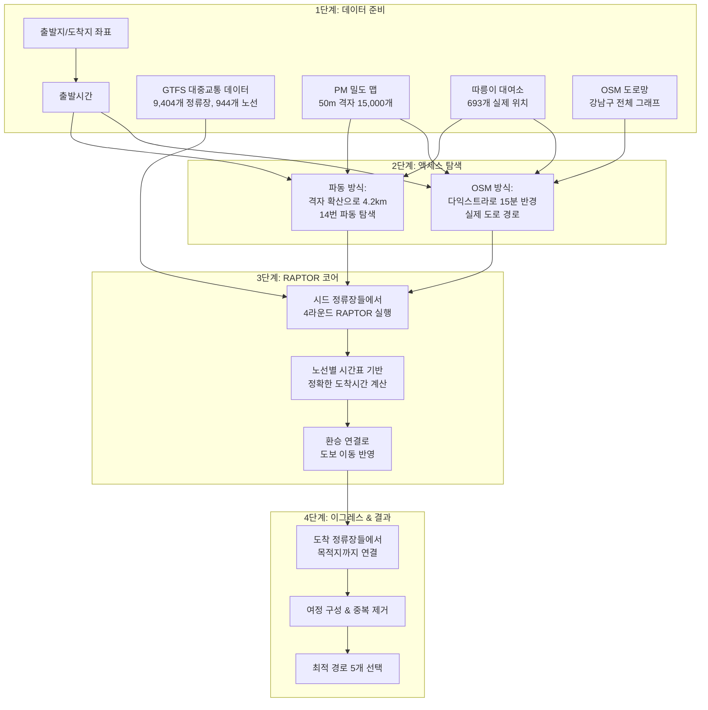
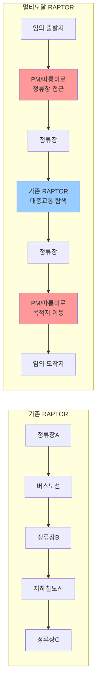
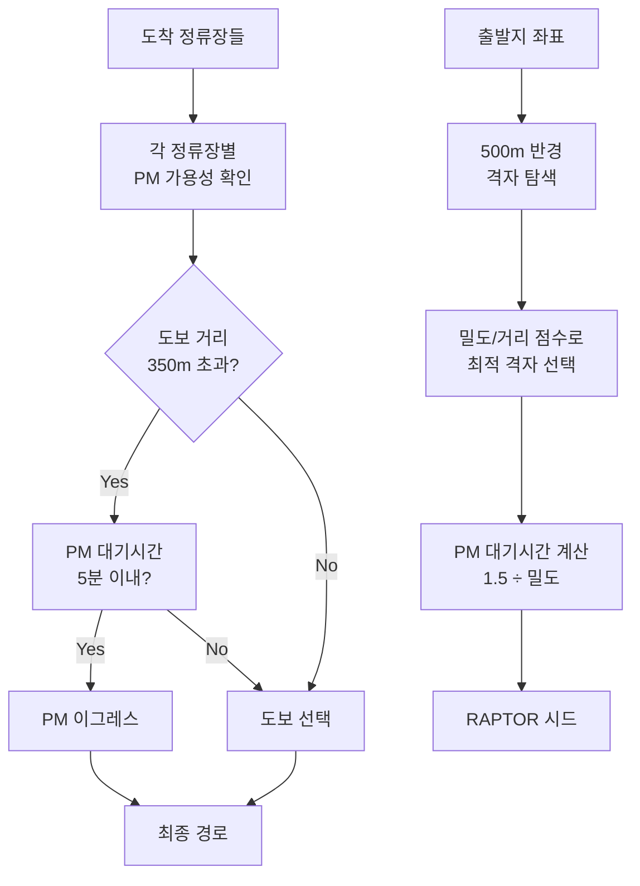
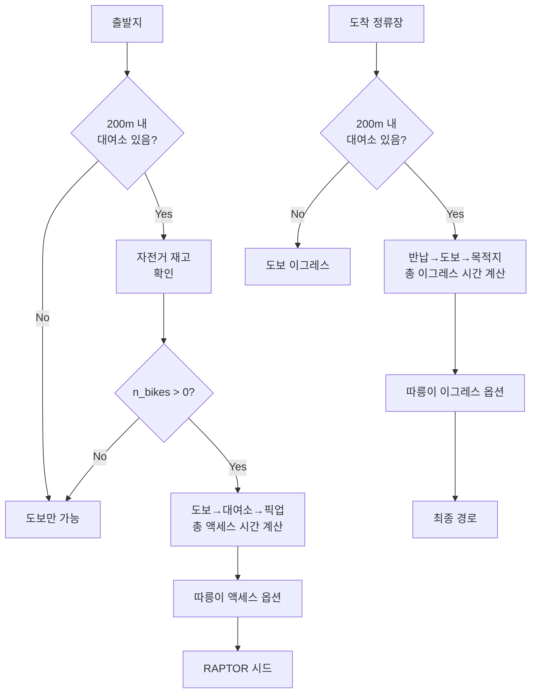
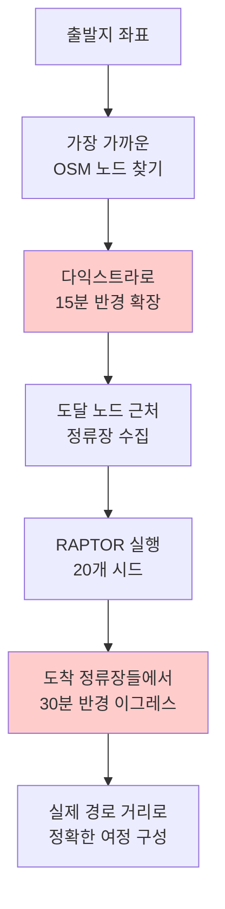
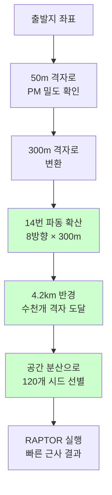

# 멀티모달 RAPTOR 알고리즘 아키텍처

## 전체 시스템 탐색 과정



## RAPTOR 확장 논리

### 기존 RAPTOR vs 멀티모달 RAPTOR 차이점

**기존 RAPTOR 한계:**
- 정류장에서 정류장으로만 이동 가능
- 대중교통 노선만 고려
- 출발지/도착지가 정류장이어야 함

**멀티모달 RAPTOR 확장:**
- 임의 좌표에서 출발/도착 가능
- PM/따릉이로 정류장 접근
- 액세스/이그레스 계층 추가



## PM 통합 탐색 논리

### PM 가용성 모델링 과정

**1단계: 밀도 맵 구축**
- Swing 실제 수요 데이터 수집
- 강남구를 50m × 50m 격자로 분할 (총 15,000개)
- 각 격자별 PM 밀도 계산 (0.05 ~ 0.95 정규화)

**2단계: 액세스 탐색**
- 출발지 주변 500m 반경 격자 탐색
- 밀도와 거리를 종합한 점수로 최적 격자 선택
- 선택된 격자의 밀도로 PM 대기시간 계산: `대기시간 = 1.5 / 밀도`

**3단계: 이그레스 선택**
- 각 도착 정류장별 PM 가용성 분석
- 도보 거리 350m 초과시 PM 이그레스 우선 고려
- PM 대기시간 5분 이내면 도보 대신 PM 선택



## 따릉이 도킹 제약 처리

### 따릉이 시스템 특성
- **고정 대여소**: 693개 실제 위치, 이동 불가
- **도킹 제약**: 반드시 대여소에서 대여/반납
- **재고 제한**: 실시간 자전거 수량 확인 필수
- **접근 제한**: 대여소까지 도보 200m 이내

### 탐색 논리
**액세스 과정:**
1. 출발지 200m 반경 내 대여소 탐색
2. 각 대여소별 자전거 재고 확인 (n_bikes > 0)
3. 출발지 → 대여소 도보시간 + 픽업시간(30초) 계산
4. 유효한 대여소들을 액세스 옵션으로 수집

**이그레스 과정:**
1. 도착 정류장들 각각에서 200m 반경 대여소 탐색
2. 반납 가능 대여소 확인 (도킹 공간 확인)
3. 대여소 → 도착지 도보시간 + 반납시간(30초) 계산
4. 총 소요시간으로 따릉이 vs 도보 비교



## 두 알고리즘 탐색 방식 비교

### OSM 다익스트라 방식: 정확한 도로망 탐색

**핵심 아이디어:**
- 실제 OSM 도로 그래프에서 다익스트라 알고리즘 실행
- 출발지를 가장 가까운 도로 교차점(OSM 노드)에 매핑
- 도로 엣지의 실제 거리와 이동 속도로 정확한 소요시간 계산

**탐색 과정:**
1. **좌표→노드 매핑**: 출발지를 OSM 그래프의 실제 노드에 연결
2. **다익스트라 확장**: 15분 반경까지 모든 도달 가능 노드 탐색
3. **정류장 매칭**: 도달 가능 노드 근처의 정류장들 수집
4. **RAPTOR 실행**: 수집된 정류장들을 시드로 대중교통 탐색
5. **이그레스 다익스트라**: 도착 정류장들에서 30분 반경 탐색



### 이중 격자 파동 확산: 빠른 근사 탐색

**핵심 아이디어:**
- 50m 정밀격자와 300m 거대격자의 이중 시스템
- 파동 확산으로 동심원 형태의 빠른 탐색
- 격자 단위 근사로 계산 복잡도 대폭 감소

**탐색 과정:**
1. **50m 격자 매핑**: 출발지를 정밀격자로 변환, PM 밀도 확인
2. **300m 격자 변환**: 탐색 효율을 위해 거대격자로 변환
3. **파동 확산**: 14번 파동으로 4.2km 반경까지 BFS 탐색
4. **공간 프루닝**: 300m 셀당 최대 1개씩 총 120개 시드 선별
5. **격자→정류장**: 격자 중심에서 가까운 정류장들로 매핑



### 방식별 특징 비교

| 구분 | OSM 다익스트라 | 이중 격자 파동 |
|------|-------------|-------------|
| **정확도** | 실제 도로 거리 | 격자 근사 거리 |
| **속도** | 상대적 느림 | 매우 빠름 |
| **메모리** | OSM 그래프 필요 | 격자 시스템 |
| **확장성** | 도로망 크기 의존 | 격자 수 의존 |
| **적용 분야** | 정밀 라우팅 | 실시간 서비스 |

## 최적화 기법과 탐색 효율성

### 공간 인덱싱 최적화
**KDTree 활용:**
- 정류장, 격자, 대여소 좌표를 KDTree로 인덱싱
- 근접 검색 시간복잡도: O(log n)
- 반경 기반 탐색에서 선형 탐색 대비 100배 이상 빠름

**프루닝 전략:**
- **공간 분산**: 300m 셀당 최대 1개 시드 유지
- **시간 기반**: 같은 정류장 중 가장 빠른 도착시간만 유지
- **수량 제한**: 최대 120개 시드로 RAPTOR 입력 제한

### RAPTOR 코어 최적화
**라운드별 전파 제한:**
- 1라운드: 직접 연결 노선만
- 2라운드: 1회 환승 경로
- 3라운드: 2회 환승 경로  
- 4라운드: 3회 환승 경로 (최대)

**시간표 기반 정확성:**
- 실제 GTFS 시간표로 정확한 도착시간 계산
- 승객 도착시간 이후 출발하는 차량만 고려
- 노선별 실시간 스케줄 반영

```mermaid
graph TD
    A[수천개 후보 위치] --> B[KDTree 근접 검색<br/>O(log n)]
    B --> C[공간 분산 프루닝<br/>300m 셀당 1개]
    C --> D[시간 기반 필터링<br/>가장 빠른 도착만]
    D --> E[120개 시드 선별]
    E --> F[RAPTOR 4라운드<br/>효율적 전파]
    F --> G[파레토 최적화<br/>중복 제거]
    G --> H[최적 경로 5개]
    
    style B fill:#ffffcc
    style C fill:#ffffcc
    style D fill:#ffffcc
```

### 메모리 및 계산 최적화
**데이터 구조 최적화:**
- OSM 그래프: pickle 파일로 캐싱, 반복 로딩 방지
- 격자 시스템: 연속 좌표공간을 이산 격자로 단순화
- 시간표: 메모리 상주로 빠른 접근

**지연 계산:**
- 필요시에만 실제 거리 계산
- 격자 레벨에서 1차 필터링 후 정밀 계산
- 조기 종료로 불필요한 탐색 방지

이 최적화 기법들로 **대규모 도시 교통망에서도 실시간 응답**이 가능한 확장 가능한 시스템을 구현했습니다.